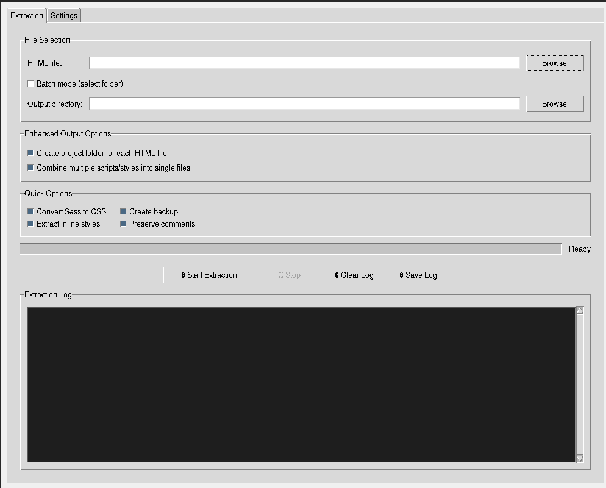

[](LICENSE)

---

## GitHub Usage | استخدام جيت هب

- Fork or clone this repository to your machine.
- Submit issues or pull requests for improvements.

- قم بعمل fork أو clone لهذا المستودع على جهازك.
- أرسل المشاكل أو طلبات السحب لأي تحسينات.

---

# HTML JS/CSS/Sass Extractor GUI

واجهة رسومية لاستخراج ملفات الجافاسكريبت وCSS وSass من ملفات HTML

---

## Description | الوصف

This tool provides a graphical interface to extract JavaScript, CSS, and Sass from HTML files, organize them into a standard project structure, and optionally convert Sass to CSS. It supports batch processing and various output options.

توفر هذه الأداة واجهة رسومية لاستخراج ملفات الجافاسكريبت وCSS وSass من ملفات HTML وتنظيمها في هيكل مشروع قياسي، مع إمكانية تحويل Sass إلى CSS. تدعم معالجة عدة ملفات دفعة واحدة وخيارات إخراج متعددة.

---

## Features | الميزات
- Extract JS, CSS, and Sass from HTML files | استخراج JS وCSS وSass من ملفات HTML
- Batch mode for folders | وضع الدفعة للمجلدات
- Convert Sass to CSS (requires libsass) | تحويل Sass إلى CSS (يتطلب libsass)
- Minify output | تصغير الملفات الناتجة
- Preserve or remove comments | الحفاظ على التعليقات أو إزالتها
- Create backup of original HTML | إنشاء نسخة احتياطية من HTML الأصلي
- GUI in English, instructions in Arabic & English | واجهة إنجليزية وتعليمات عربية وإنجليزية

---

## Installation | التثبيت

1. **Python 3.7+ required** | يتطلب بايثون 3.7 أو أحدث
2. Install dependencies | تثبيت المتطلبات:

```bash
pip install -r requirements.txt
```

If you want Sass support: | إذا كنت تريد دعم Sass:
```bash
pip install libsass
```

---

## Usage | طريقة الاستخدام

Run the application: | شغل التطبيق:

```bash
python gui_html_extractor.py
```

Follow the GUI instructions to select HTML files and output options. | اتبع تعليمات الواجهة الرسومية لاختيار ملفات HTML وخيارات الإخراج.

---

## Requirements | المتطلبات
- Python 3.7+
- tkinter (usually included with Python)
- libsass (optional, for Sass to CSS)

---

## Screenshots | لقطات الشاشة

**Main Interface | الواجهة الرئيسية**


**Extraction Log Example | مثال على سجل الاستخراج**



---

## Author | المؤلف
- Mohammed

---

## License | الرخصة
MIT 

--- 