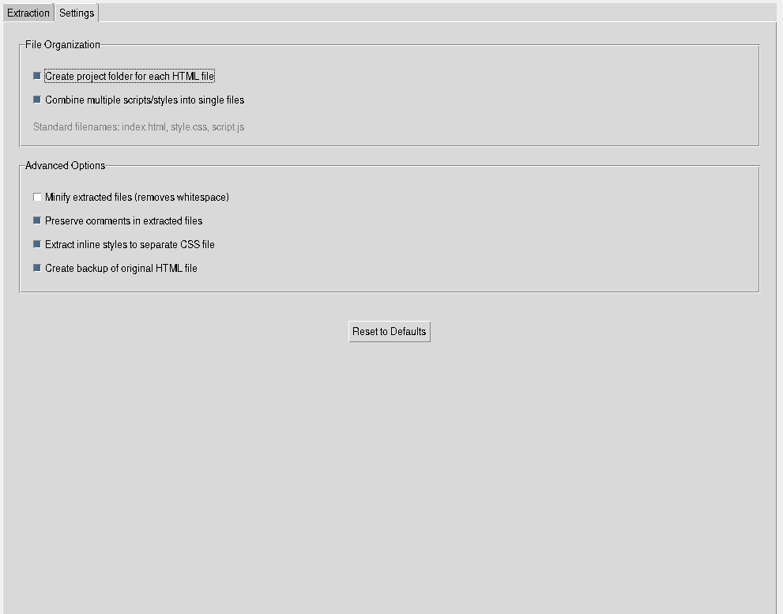
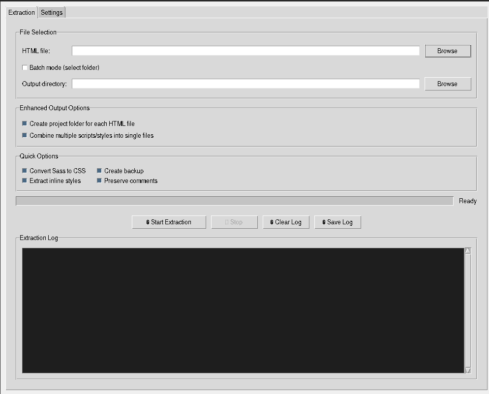

# أداة استخراج جافاسكريبت وCSS وSass من HTML (واجهة رسومية)

هذه الأداة تتيح لك استخراج ملفات الجافاسكريبت وCSS وSass من ملفات HTML بسهولة عبر واجهة رسومية. يمكنك تنظيم الملفات الناتجة في هيكل مشروع قياسي، وتحويل Sass إلى CSS إذا رغبت بذلك.

---

## الميزات
- استخراج JS وCSS وSass من ملفات HTML
- معالجة عدة ملفات دفعة واحدة
- تحويل Sass إلى CSS (يتطلب libsass)
- تصغير الملفات الناتجة
- الحفاظ على التعليقات أو إزالتها
- إنشاء نسخة احتياطية من HTML الأصلي
- تعليمات عربية بالكامل

---

## التثبيت

1. يتطلب بايثون 3.7 أو أحدث
2. ثبّت المتطلبات:

```bash
pip install -r requirements.txt
```

لدعم Sass:
```bash
pip install libsass
```

---

## طريقة الاستخدام

شغّل التطبيق:

```bash
python gui_html_extractor.py
```

اتبع تعليمات الواجهة الرسومية لاختيار الملفات والإعدادات.

---

## المتطلبات
- Python 3.7+
- tkinter (عادةً مرفق مع بايثون)
- libsass (اختياري)

---

## لقطات الشاشة

**الواجهة الرئيسية**



**مثال على سجل الاستخراج**



---

## المؤلف
- محمد

---

## الرخصة
MIT 

---

## لقطات الشاشة

**الواجهة الرئيسية**


**مثال على سجل الاستخراج**


--- 